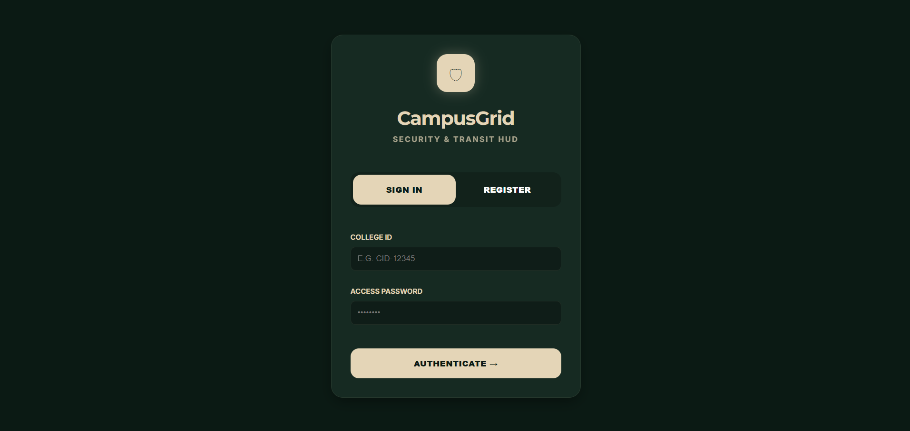
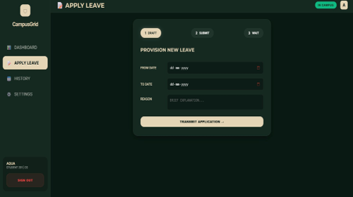
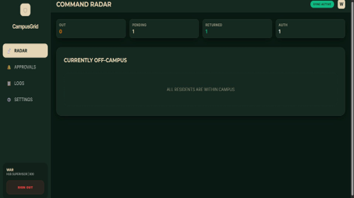
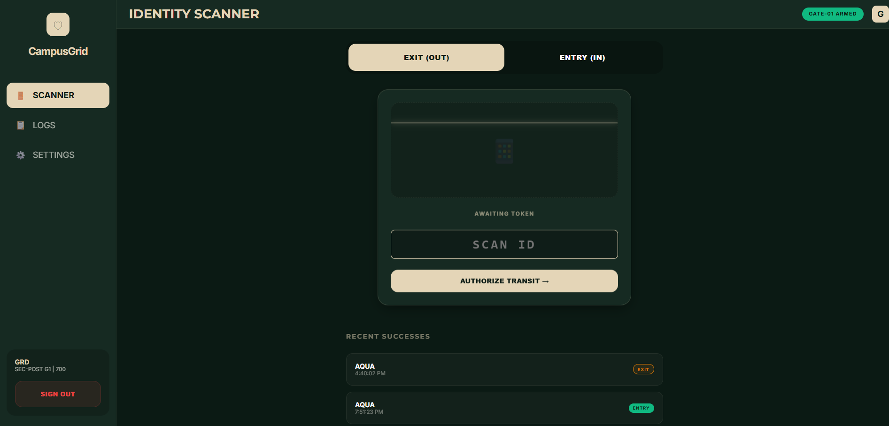

# 🛡️ CampusGrid

<p align="center">
  <b>Hostel Leave Management & Security Transit HUD</b><br/>
  A role-based gatepass workflow platform — from leave requests to secure QR-code gate scanning.
</p>

<p align="center">
  🚀 Designed for streamlined college campus security and student transit tracking.
</p>

---

## 📸 Product Preview

### 🚀 Landing Page / Identity Portal
<p align="center">
  
</p>

<p align="center">
  <b>Secure Role-Based Access</b><br/>
  A unified entry point where Students, Wardens, and Guards authenticate and are routed to their respective dashboards with strict access control.
</p>

---

### 🎓 Student Dashboard
<p align="center">
  
</p>

<p align="center">
  <b>Seamless Leave Management</b><br/>
  Students can apply for leave, track approval status in real time, and access dynamically generated QR transit passes.
</p>

---

### 🧑‍💼 Warden Dashboard
<p align="center">
  
</p>

<p align="center">
  <b>Efficient Approval Control</b><br/>
  Wardens can review all leave requests, approve or reject them instantly, and maintain full oversight of student movement.
</p>

---

### 🛂 Guard Dashboard
<p align="center">
  
</p>

<p align="center">
  <b>Real-Time Gate Monitoring</b><br/>
  Guards scan QR codes to log student Entry/Exit securely, ensuring accurate and tamper-proof transit records.
</p>

---
---

## 🚀 Overview

Managing hostel leaves manually (paper slips/registers) leads to:
- Lost or forged paper passes
- Slow approval turnaround times
- Inaccurate tracking of student whereabouts
- Lack of immediate notifications

**CampusGrid** eliminates these issues with a digital, centralized system that guarantees data integrity, speeds up approvals, and automates physical gate logging via QR codes.

---

## ⚙️ Features

### 🧠 Core Functionality
- **End-to-End Leave Workflow**: Request → Warden Approval → QR generation → Guard Scan at Gate.
- **Real-Time Dashboards**: Custom interfaces for Students, Wardens, and Security Guards.
- **Dynamic QR Tokens**: Automatically generated transit tokens upon leave approval for secure gate scanning.
- **Automated Notifications**: Database-triggered notifications to keep students informed of their application states.

---

### 🛡️ Access Control & Flow
- **Three-Tier Role System**:
  - **Student**: Apply for leaves, view status, access active QR passes.
  - **Warden**: Oversee all pending applications, one-click approve/reject actions.
  - **Guard**: Specialized HUD for scanning QR codes and updating transit logs (Entry/Exit).
- **Row Level Security (RLS)**: Enforced via the database to ensure strictly scoped data access.

---

### 📊 Data Validation & Security Logging
- Automatic transition states (`PENDING` → `APPROVED` → `OUT` → `RETURNED`).
- Immutable Gate Logs tracking exact timestamps and the ID of the guard granting gate access.
- Structured Postgres Schemas preventing invalid state interactions.

---

### 🎨 UI/UX
- Clean, dark-mode focused, glassmorphism aesthetics.
- Optimized for mobile (for Guards and Students) and desktop (for Wardens).
- Real-time toast notifications and smooth CSS micro-animations.

---

## 🧱 Tech Stack

**Frontend**
- HTML5, CSS3 (Vanilla / Custom Properties)
- Vanilla JavaScript

**Backend / Database**
- **Supabase** (PostgreSQL)
- Supabase JS Client for direct DB interactions
- Database Triggers & Postgres Functions (for notifications)

---

## 🧩 System Design Highlights

- **Serverless Architecture**: The frontend securely connects directly to the Supabase database utilizing Row-Level-Security (RLS).
- **Database Triggers**: Real-time notifications are automatically created inside PostgreSQL using triggers on state changes.
- **Strict Role Mapping**: Pre-defined ENUMs and mapped routing ensures users never access authorized portals.

---

## 🛠️ Setup & Installation

### 1. Clone & Open
```bash
# Clone the repository
git clone https://github.com/yourusername/CampusGrid.git

# Navigate into project
cd CampusGrid
```

### 2. Database Setup (Supabase)
1. Create a new project on [Supabase](https://supabase.com).
2. Go to your Supabase SQL Editor.
3. Simply execute the provided `database_schema.sql` file. This single script handles everything:
   - Creating tables and relationships.
   - Setting up Enums (`user_role`, `leave_status`).
   - Establishing Database Triggers & Policies.

### 3. Environment Variables
1. Create a `.env` file in the root of the project (if you are utilizing a bundler later) or directly configure your keys.
2. In `config.js`, temporarily paste your generated Supabase URL and ANON KEY into the configuration variables for local testing.
   *(Note: Ensure `config.js` is kept out of your commits while real keys are active!)*

### 4. Run Locally
Because this project utilizes Vanilla Web Technologies, no Node server is inherently required. 
Simply utilize an extension like **Live Server** in VS Code to run the project.

```bash
# Example with npm's serve package
npx serve .
```
